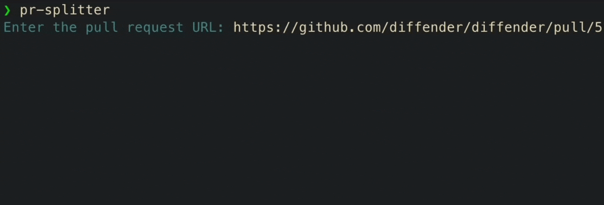
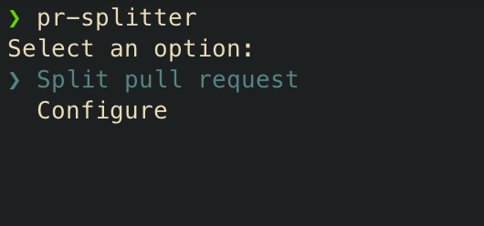

# pr-splitter

> Automatically break up large pull requests



## Install

```
npm install -g pr-splitter
```

## Usage

Run `pr-splitter` without arguments to launch the interactive UI that guides you through breaking up a pull request into smaller pull requests.



## Configuration

To send requests to an LLM, `pr-splitter` asks for the LLM provider, API key, and optionally a custom LLM endpoint.

To perform git operations, `pr-splitter` asks for a GitHub personal access token.

These config values are stored in your system keychain, and requests are sent directy to these services.

## Contributing

Some ways to contribute include:

- [Adding a benchmark](./benchmarks/)
- Improving the speed of hunk grouping
- Adding support for missing LLM providers
- Allowing custom split instructions
- Modify the split process to run tests in the repo for each commit it suggests
- Include a command to automatically rebase `PR n +1` after `PR n` is merged
